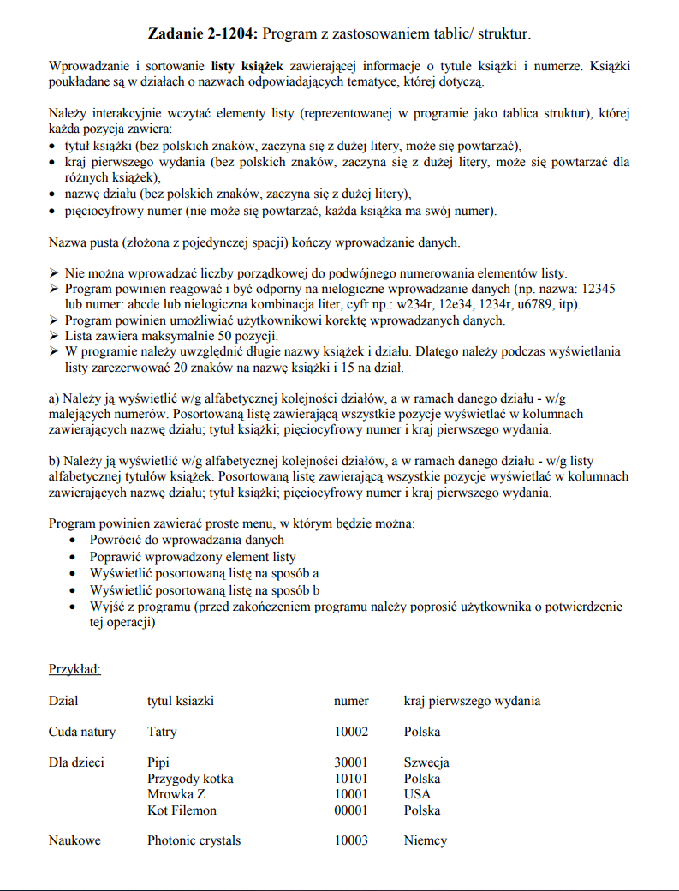

# BookList
> Simple application for adding, sorting and displaying book lists

## Table of contents
* [General info](#general-info)
* [Technologies](#technologies)
* [Features](#features)

## General info
Project made for subject Programming Basics on the 1. semester on Warsaw University of Technology

## Technologies
* C

## Features
* The program interactively loads the elements of the list of which
each item includes:
  - book title (starts with a capital letter, may repeat itself),
  - country of the first publication (starts with a capital letter, may repeat for different books),
  - section name (starts with a capital letter),
  - five-digit number (cannot repeat, each book has a number).
* displaying in alphabetical order of sections, and within a given section - according to decreasing numbers. It displays a sorted list containing all items in columns
containing the name of the department, book's title, five-digit number and country of first issue.
* displaying in alphabetical order of sections, and within a given section - according to the alphabetical list of book titles. It displays a sorted list containing all items in columns containing the name of the department, book's title, five-digit number and country of first issue.
* The program reacts and is resistant to illogical data input (e.g. name: 12345 or number: abcde or an illogical combination of letters, numbers, e.g. w234r, 12e34, 1234r, u6789, etc.).
* The program allows the user to correct the entered data.
* The program includes a simple menu where you can:
  - return to data input
  - correct the entered list item
  - display a sorted list as a
  - display a sorted list as b
  - exit the program (before exiting, the program asks the user to confirm this operation)